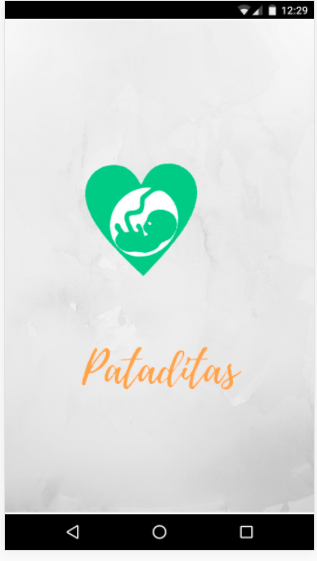
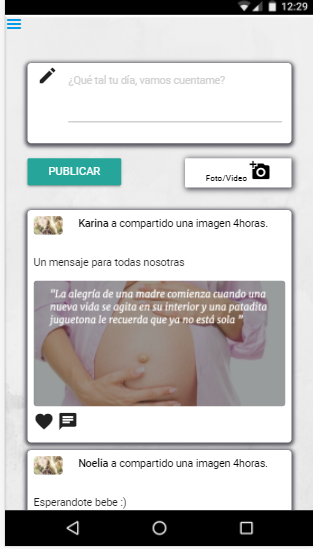
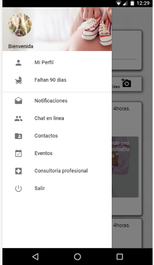
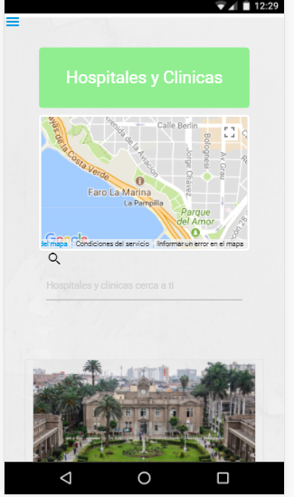

#  RED SOCIAL: Pataditas

* Curso: *Reto de Código*
* Unidad: *Agiliza tu desarrollo*
---
El presente proyecto consiste en crear una red social;  No nos da detallan  sobre qué tipo de red social se quiere, solo nos piden que creemos la que mejor podamos y que luego lo convenzamos de que nuestra red social será la más exitosa.

## Objetivo
---
* Nuestra red creada este pensada en nuetro usuarios y las necesidades de aquellas.

## Flujo de la Aplicación
* Perfiles de usuarios
* Un newsfeed donde puedes ver las actualizaciones de todos tus contactos
* Un lugar donde poder escribir posts
* Un lugar para subir fotos
* Capacidad para poder tener amigos o para poder seguir a    personas/marcas dentro de la red social
* Ser mobile friendly
* Trabajar en parejas
* Tener una planificación
* La definición del diseño
* Diseño mobile friendly
* Desplegar el producto en Github Pages
* Opcional, si se desarrolla un login o se desea almacenar la información en una base de datos, usar Firebase.
---
# Pataditas

## Introducción: Pataditas
Pataditas es una red social para mujeres gestantes donde las ayudamos que no se sientan solas en su proceso sino en encontrar a muchas mujeres pasando por lo mismo y puedan darse tips, ademas conversen entre ellas y otros recuersos mas para ayudarlas por ejemplo ver en que hospital o clinica desean ir para sus controles o al momento del parto.

### Home
 Una vez iniciada sesion mostrara un cuadro donde puedes publicar con sus otros contactos como va su proceso de gestación.

## Menu
 Aqui le damos la variedad a nuestras futuras mamás

por ejemplo

## Autor
***
* Nelida Sheridan Quispe Tacuri.
* Longhi Nicol Valverde Mejia
